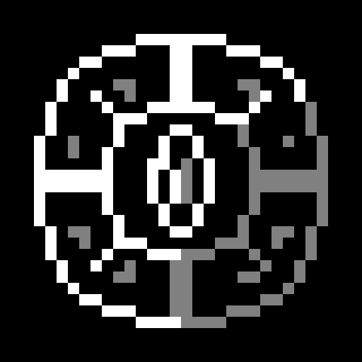

<p align="center">
  
</p>

# Tetra Apothic Link

Tetra Apothic Link is a Minecraft 1.20.1 Forge addon that connects Tetra and Tetrawear equipment with Apotheosis loot categories, affixes, gems, reforging, and high-level enchantment progression.

The addon keeps Tetra's modular structure authoritative. Apotheosis effects are resolved against the actual tool or armor context, while magic capacity and structural integrity remain separate budgets.

## Features

- Classifies Tetrawear armor as light or heavy from its resolved structural weight.
- Adds light/heavy armor loot categories, affix rules, gem rules, and armor-specific effects.
- Makes modular Tetra tools and ranged weapons participate in appropriate Apotheosis categories.
- Adds four Arcane Capacity Inscription tiers without replacing or extending Tetra's original Gild improvement.
- Adds a staged scroll progression using Apotheosis infusion setups from the Overworld through the End.
- Scales Tetrawear's temporary energy attack bonus against high armor values.
- Provides data-driven applicability, armor-weight, tool-category, gem-patch, and special-effect rules.
- Optionally integrates with Create: Enchantment Industry for scroll printing and explicit overload handling.

## Arcane Capacity progression

| Tier | Capacity | Integrity | Scroll stage | Workbench material |
| --- | ---: | ---: | --- | --- |
| I | +60 | 0 | Overworld infusion | Gem Dust + Uncommon Material |
| II | +120 | -1 | Nether Quanta or Ocean Arcana infusion | Gem Dust + Rare Material |
| III | +200 | -1 | Deep Dark balanced infusion | Gem Dust + Epic Material |
| IV | +300 | -2 | End draconic infusion | Gem Dust + Mythic Material |

Tier I requires Tetra's existing Gild V improvement. Each later tier upgrades the previous inscription rather than stacking a separate capacity modifier.

## Requirements

| Mod | Supported range |
| --- | --- |
| Minecraft | 1.20.1 |
| Forge | 47.4.16 to below 48 |
| Tetra | 6.17.x |
| Tetrawear | 1.0.x |
| Apotheosis | 7.4.8 to below 7.5.0 |
| Placebo | 8.6.3 to below 9.0.0 |
| Apothic Attributes / AttributesLib | 1.3.7 to below 2.0.0 |

Optional integrations:

- Tetracelium 1.3.x
- Create: Enchantment Industry 2.5.x
- Tetra Insight 0.1.6 or newer is recommended on the client for detailed Holosphere browsing.

Jade and JEI are used in the development runtime, but are not required by this addon.

## Installation

Install the required mods and place the release JAR in the `mods` folder on both the client and server. Keep the same addon version and datapack rules on both sides.

Server settings are written to `tetra_apothic_link-server.toml`. Most compatibility rules can also be overridden with datapacks under the `tetra_apothic_link` reload-listener directories shipped in the JAR.

## Building

Java 17 is required.

```text
./gradlew clean test build
```

The release JAR is generated under `build/libs/`. Do not distribute the `-sources.jar` as the playable mod.

## 中文简介

Tetra Apothic Link 为 Tetra、Tetrawear 与神化建立完整联动：根据模块结构识别工具与轻重甲类别，让神化词缀、宝石与重铸正确作用于模块化装备，并提供四档“魔力刻印”成长线。

魔力刻印不会覆盖或继续提升原版镀金等级。卷轴依次使用主世界、下界或海洋、深暗之域、末地阶段的神化灌注条件解锁；工作台安装则消耗宝石粉和对应等级的重铸材料。

## License

Code and original project artwork are available under the [MIT License](LICENSE).
